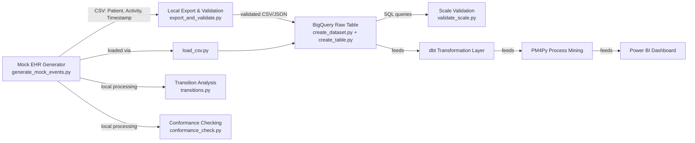

# CareFlow — Data Engineering Architecture

## Pipeline Flow

## Component Responsibilities

| Component | Responsibility |
|---|---|
| `schema/ehr_event_schema.py` | Single source of truth for event structure (Patient, Activity, Timestamp) and the fixed activity set |
| `departments.py` | Maps activities to physical hospital departments for staffing/load context |
| `generate_mock_events.py` | Simulates realistic patient journeys, including the deliberate 40% Triage rebounce bottleneck, with triangular-distributed realistic timing |
| `export_and_validate.py` | Local structural validation (headers, nulls, valid activities, chronological order) before data ever reaches BigQuery |
| `transitions.py` | Extracts and aggregates timing between every consecutive activity pair — the raw material for bottleneck detection |
| `conformance_check.py` | Compares every patient case against the hospital's ideal/mandated path, flagging and categorizing deviations |
| `gcp_bigquery/create_dataset.py`, `create_table.py` | Provisions the BigQuery warehouse: dataset + a table partitioned by day and clustered by case_id/activity_name |
| `gcp_bigquery/load_csv.py` | Loads generated data into BigQuery, with append/truncate control for iterative reloads |
| `gcp_bigquery/validate_scale.py` | Validates data volume and chronological ordering directly via SQL, designed to scale beyond what local Python looping could handle |

## Design Decisions Worth Noting

- **CSV schema stayed stable across all 9+ days of changes.** Every new feature (departments, timing realism, rebounce logic) was added as additional processing or reporting *around* the core 3-column format, never by changing it — meaning the BigQuery table built on Day 5 never needed a schema migration.
- **Local validation before warehouse validation.** Structural checks run cheaply against the CSV before any BigQuery cost is incurred; SQL-based checks then validate the same data at scale, in the warehouse, using window functions instead of pulling rows into Python.
- **The rebounce rate is a knob, not a fixed constant.** `--rebounce-rate` is a CLI argument throughout, making it trivial to demonstrate the pipeline at different bottleneck severities during a review.
